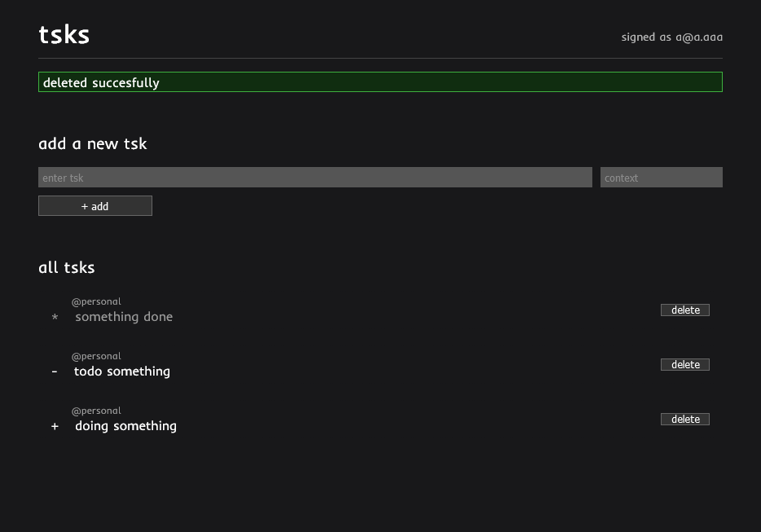

# tsks

[](https://github.com/luanrv00/tsks/actions/workflows/ci.yml)

A project for study purposes only. Built using Docker, Ruby on Rails, PostgreSQL, Thor and Next.js



## Instructions

### Running development environment

```sh
bin/dev
```

**By running `bin/api_dev` or `bin/web_dev` only these specific development servers will start.**

### Running tests

#### API tests

```sh
bin/api_test
```

#### WEB

##### Code lint tests

```sh
bin/web_lint
```

##### Unit tests

```sh
bin/web_test_unit
```

##### E2E tests

```sh
bin/web_test_e2e
```
